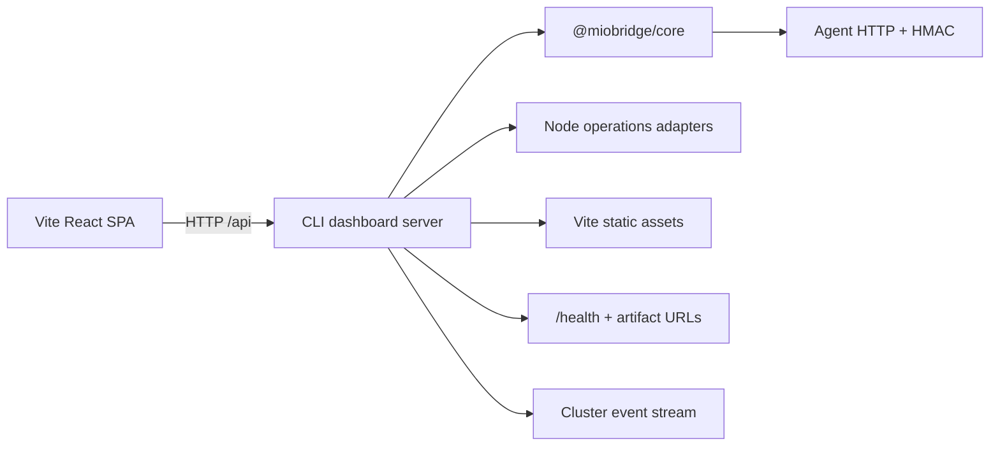

# Migrate dashboard frontend from Next SSR to Vite SPA

## Overview

Replace Next Pages Router/SSR/standalone dashboard with a Vite-built static React SPA plus a CLI-owned Node dashboard server. The server exposes stable HTTP adapters over `@miobridge/core` and frontend-owned operations services, serves static assets, owns compatibility URLs, and remains callable through the existing provider/systemd lifecycle. This is runtime migration only: preserve Botanical Garden tokens, shadcn/Radix primitives, Iconify, page IA, Agent/HMAC behavior, and existing user flows.

## Scope

- Freeze the current Next API/SSR behavior as HTTP contract fixtures before removing Next runtime.
- Add a CLI-owned Node dashboard server: thin HTTP adapters over core plus frontend operations adapters, HMAC, SSE, downloads, compatibility URLs, static provider delivery, and SPA fallback.
- Evolve dashboard provider schema/packaging from executable Next standalone to a contained static Vite artifact.
- Convert the dashboard to Vite React SPA; route/page data loads through HTTP clients, not core/frontend-server imports or `getServerSideProps`.
- Remove Next runtime/build/rewrite ownership only after static bundle/server parity passes.
- Define Vercel outcome explicitly as static Vite deployment; fn-3 must consume its final artifact/config rather than retain Next assumptions.

## Design read

Reading this as: dense technical operations dashboard for existing MioBridge operators, preserving Botanical Garden visual language and shadcn/Radix component foundation.

**Dials:** `DESIGN_VARIANCE: 3`, `MOTION_INTENSITY: 2`, `VISUAL_DENSITY: 7`.

- Preserve existing page IA, URLs, navigation labels, theme tokens, component shapes, focus behavior, and responsive layouts.
- No marketing redesign, palette replacement, generic dashboard template, new animation layer, or visual-system substitution.

## Architecture



## Approach

1. Inventory every Next route, SSR loader, response/status/header, HMAC/SSE/file contract, then lock contract fixtures.
2. Add a Node-only dashboard server inside CLI, composed from public core exports and explicitly injected operations adapters. It must never import `frontend/src/server/**` or put HTTP concerns into core.
3. Port API routes by category: core/artifacts, config/logs, node/SSH/deployment, HMAC/SSE. Preserve behavior before deleting handlers.
4. Introduce provider schema v2/static form, package Vite `dist`, and serve assets with strict containment, MIME/cache headers, API/compatibility precedence, and history fallback.
5. Move shared layout/pages/components into Vite entry/routing; replace `getServerSideProps` with typed HTTP clients and explicit loading/error/empty states while retaining Botanical Garden styles.
6. Remove Next dependencies/config/build artifacts; update CLI release/provider workflows, Vercel static configuration, CI, docs, memory, and end-to-end tests.

## Quick commands

```bash
bun run dashboard:test && bun run dashboard:typecheck && bun run dashboard:build
bun run cli:test && bun run core:test && bun run lint
cd agent && bun test
```

## Boundaries / non-goals

- No visual redesign, page IA change, auth/multi-user feature, Agent protocol change, or core business-logic duplication.
- Core remains framework/HTTP-free. SSH/deploy/logging operations remain Node adapters.
- No non-Node dashboard server, PID fallback, or breaking `miobridge dashboard` commands/provider lifecycle.
- fn-3 implementation is deferred until this Vite artifact/deployment contract lands; this task only defines its required Vercel static outcome.

## Decision Context

- Existing CLI provider v1 only launches an executable; static SPA requires provider schema evolution plus a real dashboard server. A manifest alone cannot expose core JSON APIs.
- CLI owns server composition because it is the self-hosted runtime and already owns provider/systemd lifecycle. The SPA cannot import core or frontend server code.
- Static fallback must never swallow `/api/*`, `/health`, `/subscription.txt`, `/clash.yaml`, or `/raw.txt`.
- Provider schema v2 is the canonical static form. Retain v1 read support only while existing installed Next providers need a migration path; CLI commands stay unchanged.
- Vite static output is production artifact; `vite preview` is not production server. Dev proxy may target dashboard server, with explicit host allowlists and strict port behavior.

## Risks and mitigations

- **Route behavior regressions:** lock method/query/body/status/header fixtures and run parity tests before retiring Next handlers.
- **HMAC/SSE breakage:** port canonical signing/replay checks and cleanup/heartbeat semantics with dedicated contract tests.
- **Static routing leaks/overrides APIs:** assert traversal denial, API/compat precedence, MIME/cache headers, and history fallback in live-server tests.
- **Node-only browser leakage:** package/bundle scan rejects core, Node builtins, SSH, and deployment code from Vite output.
- **Visual drift:** preserve tokens/components/page IA; run existing component tests plus browser visual/state smoke across theme/mobile/empty/error conditions.
- **Vercel/CLI divergence:** static Vite build/provider packaging and Vercel config share artifact checks; document Vercel as dashboard-only while core runtime remains CLI/self-hosted.

## Acceptance Criteria

- **R1:** `miobridge dashboard` serves a Vite-built static React bundle plus Node dashboard server with no Next.js runtime, Next build output, or Next dependency in production/provider artifact.
- **R2:** Every existing dashboard flow uses documented HTTP endpoints over the same `@miobridge/core` and operations services: status/update/artifacts, config/YAML/logs, nodes/Agent/kernel/deploy actions, and API docs; no SPA import reaches core/frontend server code.
- **R3:** `/subscription.txt`, `/clash.yaml`, `/raw.txt`, and `/health` retain exact method/status/content/header behavior; static history fallback never intercepts them or `/api/*`.
- **R4:** HMAC-protected endpoints retain canonical request signing, 30-second replay behavior, body validation, and error semantics; cluster SSE retains event/heartbeat/cleanup behavior; Agent HMAC remains unchanged.
- **R5:** Botanical Garden/shadcn/Radix/Iconify layout, navigation, themes, responsive behavior, core page flows, loading/error/empty states, and accessibility remain equivalent without SSR or `getServerSideProps`.
- **R6:** Static provider schema/packaging, foreground/systemd lifecycle, CI/release checks, Vercel static configuration, and documentation support Vite assets; removing dashboard assets leaves CLI core commands/config/data intact.
- **R7:** Tests prove static traversal/MIME/cache/API precedence, Vite client bundle excludes Node/core/SSH modules, all API contracts, browser flows, compatibility URLs, and external-cwd compiled CLI dashboard lifecycle.

## Test notes

- Contract suite snapshots HTTP method/status/body/headers for every legacy route before porting.
- HMAC tests cover timestamp window, replay, canonical body, bad/missing signatures; SSE tests cover disconnect cleanup and heartbeat.
- Live server tests cover Vite assets, deep-link fallback, content types/cache, traversal, API/compat precedence, and all compatibility URLs.
- Browser tests cover current pages, cluster/deploy actions, themes, keyboard/focus, mobile layout, loading/error/empty states, and no SSR request dependency.
- Release tests start compiled CLI plus static provider from external cwd and verify foreground/systemd lifecycle without Next/Bun runtime dependency.

## Documentation

Update README/Chinese README, CLI/CI/CD/deployment/troubleshooting/contributing docs, Vercel settings/config, and architecture/CI/deployment/coding memory. Preserve the documented provider lifecycle while replacing Next-specific examples with Vite/static-server behavior.

## References

- `frontend/next.config.js:12-43` — Next standalone/rewrite behavior to port then remove.
- `frontend/src/server/core.ts:1-64` — current Node composition boundary; mirror through CLI, never import it.
- `packages/cli/src/dashboard/provider.ts:5-129` — v1 provider containment/URL contract to evolve.
- `packages/cli/src/dashboard/foreground.ts:37-109` — CLI lifecycle/runtime path seam.
- `frontend/src/pages/api/**` and `frontend/src/pages/*.tsx` — route/SSR inventory.
- `frontend/src/styles/globals.css:6-181` — Botanical Garden tokens to preserve.
- `docs/CLI.md:77-124` — provider/systemd contract retained across runtime replacement.
- `https://vite.dev/guide/static-deploy` — static `dist` is deployment artifact; preview is not production server.
- `https://vite.dev/config/server-options` — dev proxy/host/strict-port security choices.

## Early proof point

Task `fn-4-migrate-dashboard-frontend-from-next.1` proves legacy routes can be frozen as contract fixtures and replayed against a CLI-owned HTTP server without importing Next/frontend-server code. If it fails, revise server/API ownership before porting SPA pages or static packaging.

## Requirement coverage

| Req | Description | Task(s) | Gap justification |
|-----|-------------|---------|-------------------|
| R1 | Vite static bundle and no Next runtime | .4, .5, .6 | — |
| R2 | HTTP dashboard functionality | .1, .2, .3, .5 | — |
| R3 | Compatibility URL parity | .1, .2, .4, .6 | — |
| R4 | HMAC/SSE/Agent contract parity | .1, .3, .6 | — |
| R5 | Botanical Garden SPA parity | .5, .6 | — |
| R6 | Provider/lifecycle/release/Vercel support | .4, .6 | — |
| R7 | Contract/browser/static/client-boundary proof | .1, .2, .3, .4, .5, .6 | — |
